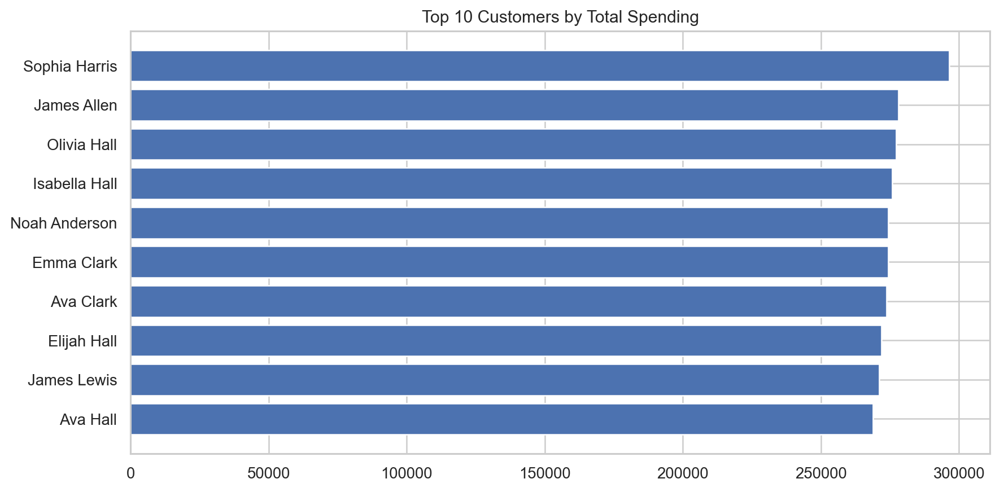
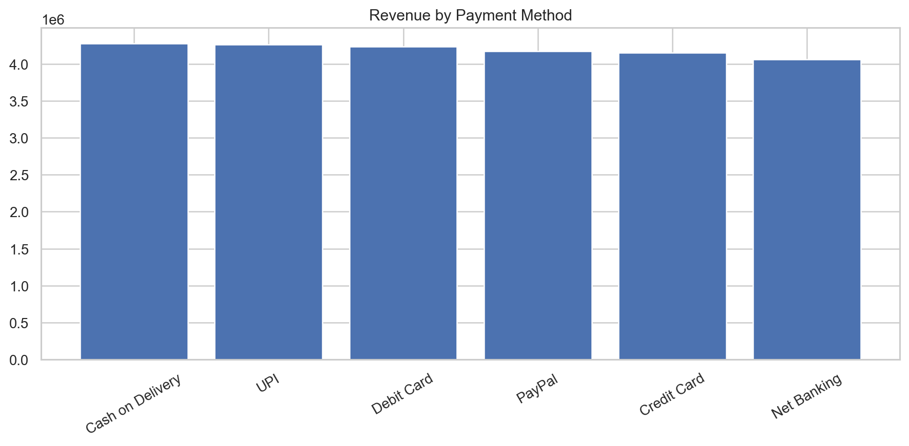

# 📊 Project 3: E-Commerce Transactions Analysis

  
  
  

---

## 🔹 Overview  
This project analyzes an **E-Commerce transactions dataset** to uncover key revenue trends, customer behavior, and payment insights.  

The final deliverables include **cleaned datasets, KPI rollups, and visualizations** ready for dashboarding in **Power BI**.

- **Tech Stack**: Python (Pandas, Matplotlib, Seaborn), SQL, Power BI  
- **Key Skills**: Data Cleaning, KPI Design, Exploratory Data Analysis (EDA), SQL Querying, Business Intelligence Storytelling  
- **Repository Tag**: `v1.1` → Finalized notebook release with HTML export + synced with remote  

---

## 🔹 Live Notebook  
👉 [View Final Notebook (HTML)](https://nbviewer.org/github/Romago10/Project3-Ecommerce-Analysis/blob/main/notebooks/Project3_Ecommerce_Analysis_Final.html)  

*(opens directly in your browser — no need to clone the repo)*  

---

## 🔹 Workflow  
1. **Data Preparation**  
   - Imported raw dataset → `data/ecommerce_transactions.csv`  
   - Cleaned + standardized into → `data/ecommerce_transactions_clean.csv`  

2. **KPI Rollups**  
   - Monthly revenue trends → `data/monthly_revenue_rollup.csv`  
   - Top categories → `data/category_revenue_rollup.csv`  
   - Regional performance → `data/region_revenue_rollup.csv`  
   - Payment methods → `data/payment_revenue_rollup.csv`  

3. **EDA & Visuals**  
   Exported insights for dashboard integration:  

   | Visualization | Preview |
   |---------------|---------|
   | Monthly Revenue Trend |  |
   | Top Categories |  |
   | Top Countries |  |
   | Top Customers |  |
   | Revenue by Payment |  |

---

## 🔹 Key Insights  
- 📈 **Revenue growth** patterns identified across months and regions  
- 🛍️ **Top categories** driving sales concentration  
- 🌍 **Regional analysis** revealing high-performing markets  
- 💳 **Payment method distribution** for customer preferences  
- 👤 **Customer segmentation** by revenue contribution  

---

## 🔹 Deliverables  
- ✅ Clean CSV exports for downstream analysis  
- ✅ Visualizations for BI dashboards  
- ✅ Finalized Jupyter Notebook (streamlined + reproducible)  
- ✅ GitHub release `v1.1` with tagged version history  
- ✅ **Live Notebook (HTML)** for easy viewing  

---

## 🔹 Next Steps  
The outputs from this notebook will be integrated into a **Power BI dashboard** for executive-level storytelling and real-time analytics.  

---

## 🔹 Repository Structure  
Project3-Ecommerce-Analysis/
│
├── data/ # Cleaned datasets & rollups (CSV)
├── powerbi/ # Exported visualizations (PNG)
├── sql/ # Queries (SQL scripts)
├── notebooks/ # Jupyter notebooks
├── README.md # Project documentation
└── .gitignore

---

 **Explore the full notebook and outputs in this repository**

