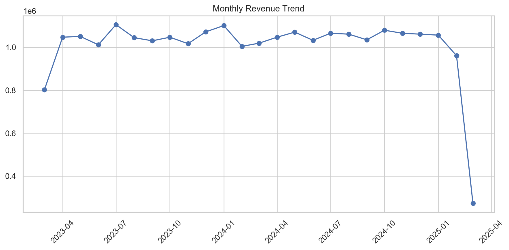
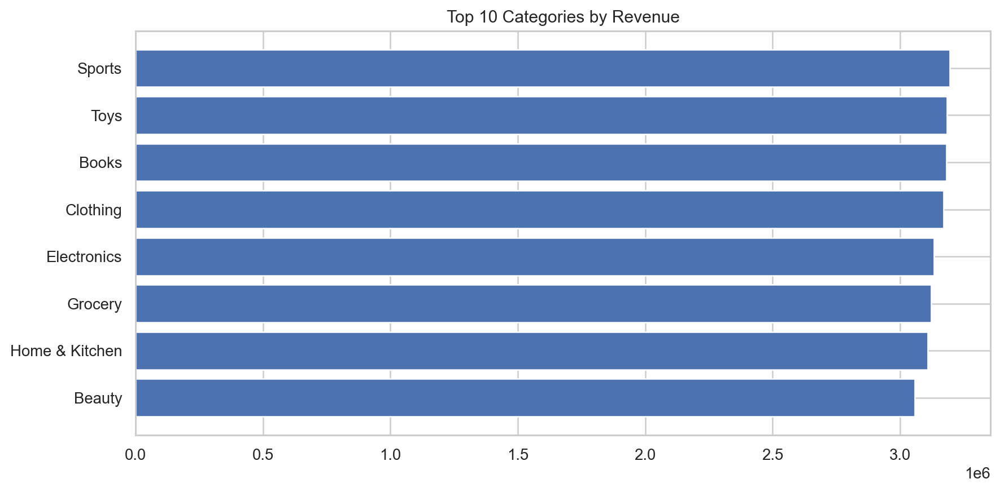
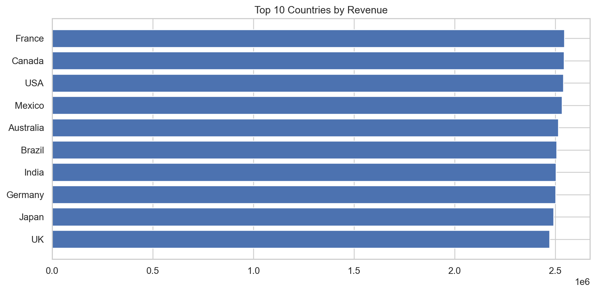
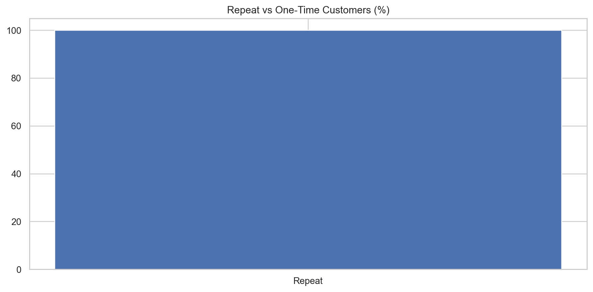

# Project 3: E-Commerce Transactions Analysis  

End-to-end analytics project using **Python, SQL, and Power BI**.  
Analyzed **50k+ e-commerce transactions** to uncover revenue, customer, and regional trends.  
Demonstrates **data cleaning, feature engineering, EDA, SQL querying, dashboarding, and business insights**.  

---

## Key Insights
- **Monthly Revenue Trend** → Revenue shows steady growth with seasonal variation.  
- **Top Categories** → Sports, Toys, and Books are the largest revenue drivers.  
- **Top Countries** → France, Canada, and USA lead overall performance.  
- **Customers** → A small set of high-value customers contribute disproportionately to revenue.  
- **Payment Methods** → Mix is fairly balanced, but COD slightly leads.  

---

## Example Visuals  

### Monthly Revenue Trend

### Top Product Categories

### Top Countries

### Repeat vs One-Time Customers

---

## Tools & Skills
- **Python** → pandas, matplotlib, seaborn for cleaning, feature engineering, and EDA  
- **SQL** → reusable queries for KPIs, revenue trends, and customer segmentation  
- **Power BI** → interactive dashboards with slicers, KPI cards, and trend charts  

---
## Repository Structure
Project3-Ecommerce-Analysis/
├── data/ # raw, cleaned datasets + CSV exports
├── notebooks/ # Jupyter notebooks (final analysis)
├── sql/ # SQL scripts (queries.sql)
├── powerbi/ # exported visuals + dashboard file
└── README.md # project documentation

---

## How to Reproduce
1. Clone this repo.  
2. Install requirements: `pandas`, `matplotlib`, `seaborn`.  
3. Run the notebook: `notebooks/Project3_Ecommerce_Analysis_Final.ipynb`.  
4. Outputs will save to `data/` (CSVs) and `powerbi/` (charts).  
5. Load CSVs into Power BI to explore the interactive dashboard.  

---
